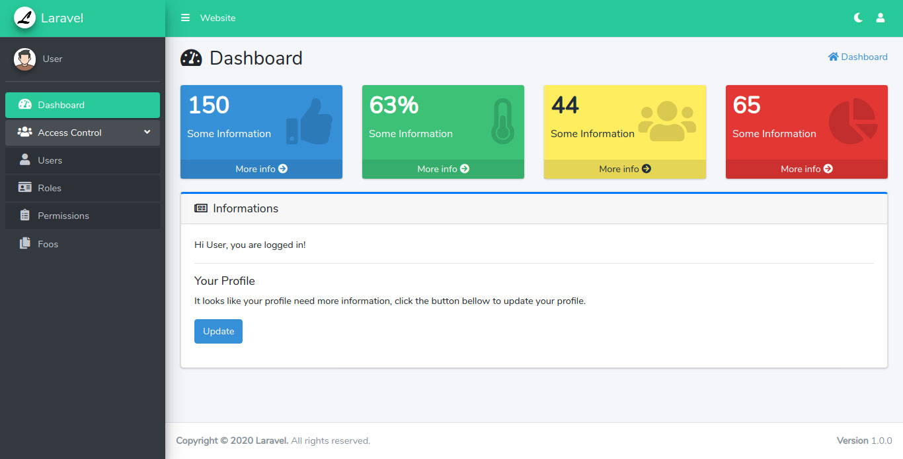

# Boilerplate Laravel 7.0 + AdminLTE 3.0.4 
A blank project with all you need to start a new application using Laravel and AdminLTE.

Use the file config/template.php to customize menu, color, version, etc.

### Features
- [x] Basic Bootstrap Template (Site)
- [x] AdminLTE Template (Admin)
- [x] User Authentication
- [X] User Profile (Basic)
- [ ] Access Control List (Basic ACL)
- [ ] CURD to manage ACL
- [X] Multi-language Support
- [X] Basic CRUD Example

### Site Preview


### Admin Preview


### Instalation
```
composer install
php artisan migrate
```

### Run
```
php artisan serve
```