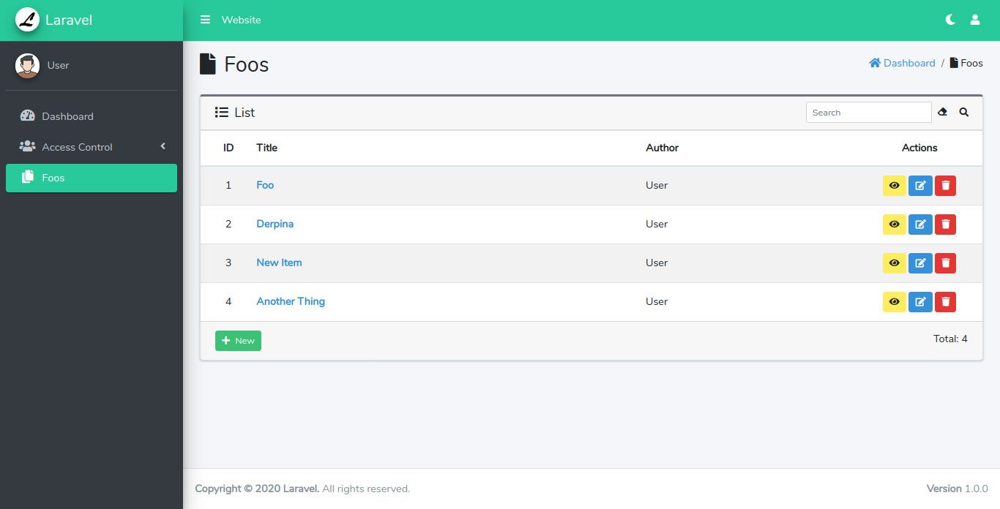
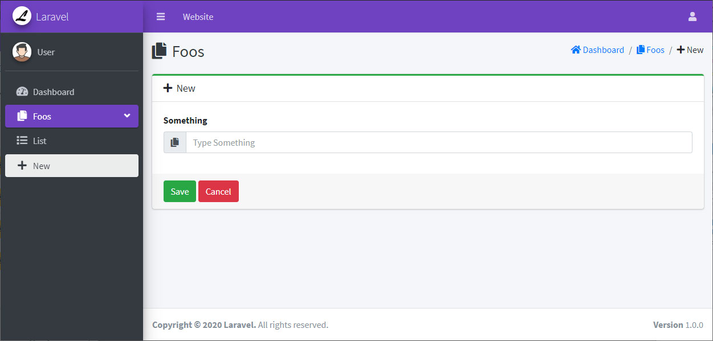

# Boilerplate Laravel 7.0 + AdminLTE 3.0.4 
A blank project with all you need to start a new application using Laravel and AdminLTE.

Use the file config/template.php to customize menu, color, version, etc.

### Features
- [x] Basic Bootstrap Template (Site)
- [x] AdminLTE Template (Admin)
- [X] Multi-language Support
- [x] User Authentication
- [X] User Profile (Basic)
- [X] Access Control List (Basic ACL)
- [X] CURD to manage Users
- [X] CURD to manage Roles and Permissions
- [X] Basic CRUD Example
- [X] Social Login

### Site Preview


### Admin Preview




### Instalation
Assuming you already have the database service running, make a copy or rename ".env.example" file to ".env" and configure some variables before.

```
composer install
php artisan key:generate
```

If you want a basic example ACL run:
```
php artisan migrate --seed
```
In this case, after creating your user, you may want to remove "Super User" as default role for new users on "/admin/roles".

If you want a clean database run:
```
php artisan migrate
```

### Run
```
php artisan serve
```

### CRUD
Here we have the steps to create a new simple CRUD, here we are going to create a CRUD of Books.

1- Create a model with migrations and controller (inside Admin/)
```
php artisan make:model Book --migration
php artisan make:controller Admin/BookController
```

2- In Book model, Add "use SoftDeletes", the fillable fields, and User relationship.
```php
namespace App;

use Illuminate\Database\Eloquent\Model;
use Illuminate\Database\Eloquent\SoftDeletes;

class Book extends Model
{
  use SoftDeletes;  
  protected $fillable = ['title', 'pages', 'user_id'];
  
  public function user()
  {
    return $this->belongsTo('App\User');
  }
}
```

3- Include the fields in the created migrations in method up(), it should looks like this
```php
Schema::create('books', function (Blueprint $table) {
  $table->id();
  $table->unsignedBigInteger('user_id');
  $table->foreign('user_id')->references('id')->on('users')->onDelete('cascade');
  $table->string('title');
  $table->integer('pages');
  $table->timestamps();
  $table->softDeletes();
});
```

4- Update the database with the new entity
```
php artisan migrate
```

5- Add resource route to Books in "/app/routes/web.php"
```php
Route::resource('books', 'BookController');
```

6- Copy the folder "/resources/views/admin/foos" to "/resources/views/admin/books"

7- In BookController, extends from CrudController class and make some configurations
```php
namespace App\Http\Controllers\Admin;

use App\Http\Controllers\CrudController;
use Illuminate\Http\Request;

class BookController extends CrudController
{
  protected $model = \App\Book::class;
  protected $onlyMine = true;
  protected $names;
  protected $item;
  protected $title;
  
  protected $rules = [
    'title' => 'required|min:3',
    'pages' => 'required|integer|min:1',
  ];
  
  function __construct()
  {
    $this->names = [
      'title' => trans('crud.title'),
      'pages' => trans('crud.pages'),
    ];

    $this->item = trans('admin.book');
    $this->title = trans('admin.books');

    parent::__construct();
  }
}
```

8- Include the Book menu into "/config/template.php"
```php
['name' => 'Books', 'icon' => 'book', 'resource' => 'books', 'permission' => 'books-view', 'children' => [
    ['name' => 'crud.list', 'icon' => 'list', 'action' => 'admin:books.index', 'permission' => 'books-view'],
    ['name' => 'crud.new', 'icon' => 'plus', 'action' => 'admin:books.create', 'permission' => 'books-create']
  ]
],
```

9- Finally add the new field "pages" and change the icon of the 3 views.

/resources/views/admin/books/list.blade.php
```html
<?php
    $icon = 'fas fa-book';
    $resource = App\Helpers\TemplateHelper::getCurrentResource();
?>
@extends('admin.layouts.template-resource-list')

@section('title')
    <i class="{{ $icon }} mr-1"></i> {{ $title }}
@endsection

@section('breadcrumb')
    <li class="breadcrumb-item"><i class="{{ $icon }}"></i> {{ $title }}</li>
@endsection

@section('thead')
    <tr>
        <th>@lang('crud.id')</th>
        <th>@lang('crud.title')</th>
        <th>@lang('crud.pages')</th>
        <th>@lang('crud.author')</th>
        <th class="text-center">@lang('crud.actions')</th>
    </tr>
@endsection

@section('tbody')
    @foreach($items as $item)
        <tr>
            <td class="align-middle">{{ $item->id }}</td>
            <td class="align-middle">
                <a href="{{ route('admin:'.$resource.'.edit', $item->id) }}" title="@lang('crud.edit')">
                    <b>{{ $item->title }}</b>
                </a>
            </td>
            <td class="align-middle">{{ $item->pages }}</td>
            <td class="align-middle">{{ $item->user->shortName() }}</td>
            <td class="align-middle text-center text-nowrap">
                @include('admin.layouts.partials.actions', [
                    'resource' => $resource,
                    'id' => $item->id,
                    'name' => $item->title
                ])
            </td>
        </tr>
    @endforeach
@endsection

@section('actions')
    @parent
@endsection

@section('pagination')
    @include('admin.layouts.partials.navegation', ['pagination' => $items])
@endsection
```

/resources/views/admin/books/show.blade.php
```html
<?php
    $icon = 'fas fa-book';
    $resource = App\Helpers\TemplateHelper::getCurrentResource();
?>
@extends('admin.layouts.template-resource-show')

@section('title')
    <i class="{{ $icon }} mr-1"></i> {{ $title }}
@endsection

@section('breadcrumb')
    <li class="breadcrumb-item"><a href="{{ route('admin:'.$resource.'.index') }}"><i class="{{ $icon }}"></i> {{ $title }}</a></li>
    <li class="breadcrumb-item"><i class="fas fa-eye"></i> @lang('crud.show')</li>
@endsection

@section('fields')
    <div class="form-group row">
        <label class="col-2 text-right">@lang('crud.title')</label>
        <div class="col">{{ $item->title }}</div>
    </div>
    <div class="form-group row">
        <label class="col-2 text-right">@lang('crud.pages')</label>
        <div class="col">{{ $item->pages }}</div>
    </div>
    <div class="form-group row">
        <label class="col-2 text-right">@lang('crud.author')</label>
        <div class="col">{{ $item->user->shortName() }}</div>
    </div>
    <div class="form-group row">
        <label class="col-2 text-right">@lang('crud.created-at')</label>
        <div class="col">{{ $item->created_at->format('d/m/Y H:i:s') }}</div>
    </div>
    <div class="form-group row">
        <label class="col-2 text-right">@lang('crud.updated-at')</label>
        <div class="col">{{ $item->updated_at->format('d/m/Y H:i:s') }}</div>
    </div>
@endsection

```

/resources/views/admin/books/form.blade.php
```html
<?php
    $icon = 'fas fa-book';
    $resource = App\Helpers\TemplateHelper::getCurrentResource();
?>
@extends('admin.layouts.template-resource-form')

@section('title')
    <i class="{{ $icon }} mr-1"></i> {{ $title }}
@endsection

@section('breadcrumb')
    <li class="breadcrumb-item"><a href="{{ route('admin:'.$resource.'.index') }}"><i class="{{ $icon }}"></i> {{ $title }}</a></li>
    <li class="breadcrumb-item"><i class="fas fa-{{ isset($item) ? 'edit' : 'plus' }}"></i> {{ isset($item) ? trans('crud.edit') : trans('crud.new') }}</li>
@endsection

@section('fields')
    <div class="form-group">
        <label for="title">@lang('crud.title') *</label>
        <div class="input-group">
            <div class="input-group-prepend">
                <span class="input-group-text"><i class="fas fa-book"></i></span>
            </div>
            <input type="text" id="title" name="item[title]" required class="form-control" value="{{ isset($item) ? $item->title : old('item.title') }}">
            <div class="invalid-feedback">@lang('crud.invalid-field', [trans('crud.title')])</div>
        </div>
    </div>
    <div class="form-group">
        <label for="pages">@lang('crud.pages') *</label>
        <div class="input-group">
            <div class="input-group-prepend">
                <span class="input-group-text"><i class="fas fa-copy"></i></span>
            </div>
            <input type="text" id="pages" name="item[pages]" required class="form-control" value="{{ isset($item) ? $item->pages : old('item.pages') }}">
            <div class="invalid-feedback">@lang('crud.invalid-field', [trans('crud.pages')])</div>
        </div>
    </div>
@endsection
```
